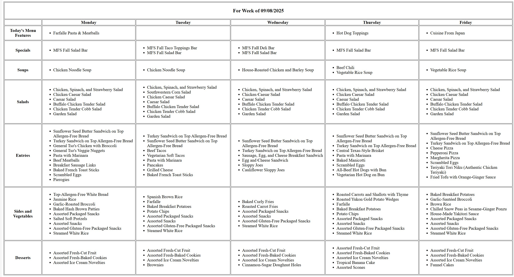

# Print School Lunch

No idea why companies and services need to make their websites so "cool" with ReactJS and other things that it becomes impossible to use.

All I want to do is print my kid's school lunch menu for the week. 

This app will take the the JSON from the service that does his lunches and parse them into the most basic of an HTML table for the week. No crazy CSS, animations, etc. But if you print it, it prints in a readable format. The only interactivity is if you press the week at the top, it will advance to next week.

This probably won't be useful for anyone else in the world unless you, too, use SageDining

Built on HTML, FastAPI, AlpineJS

